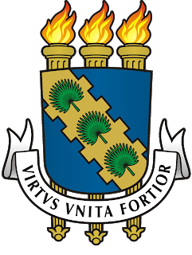

    

<h3 align="center">Universidade Federal do Ceará</h3>

Repositório dedicado para adicionar resoluções de exercícios e trabalhos para disciplina de Segurança da Informação.

### Relatorio
Nesse trabalho, tive um pouco de dificuldade na linguagem, mas conseguir fazer sozinho, apenas trocando ideias com meus colegas sobre como seria o algoritmo,
como eles fizeram para descobrir a chave e a msg. A montagem do algoritmo foi mais simples que a do primeiro trabalho, a maior dificuldade foi na leitura e
escrita de arquivo com python.
