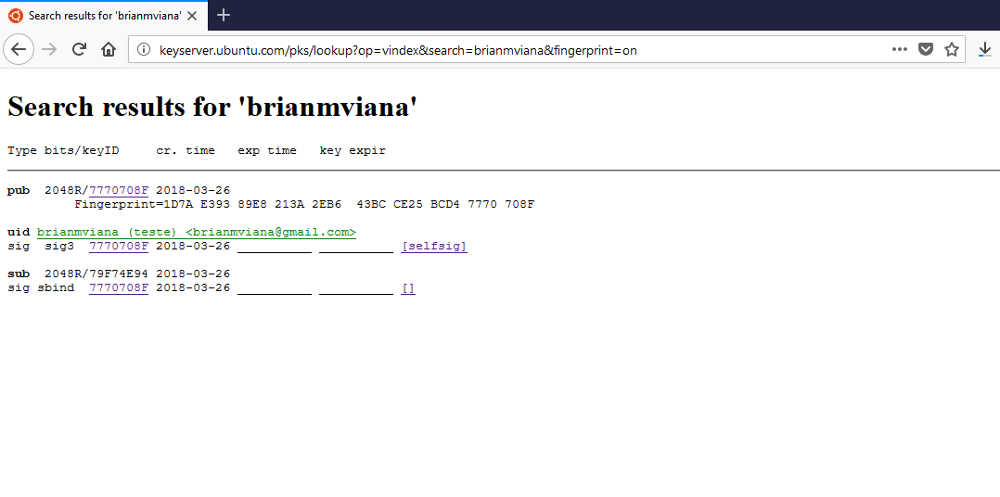
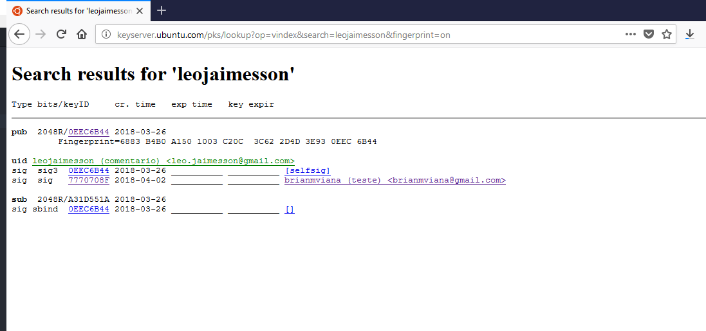

# Atividade GPG
### Relatório
Essa atividade fiz em dupla com o Leo Jaimesson, no inicio estávamos com alguns dificuldades, em especial para subir a chave para o servidor, mas com um pouco de pesquisa conseguimos realizar toda  atividade proposta. Nessa atividade aprendi a criar, assinar uma chave além de criptografa uma mensagem. Em media gastamos de 3 a 4 horas para realizar todos os passo.  

