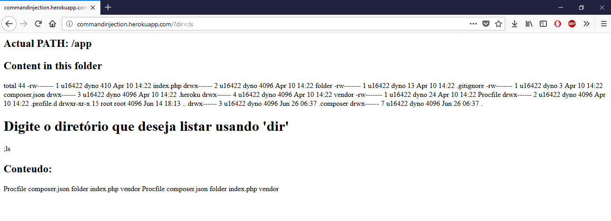
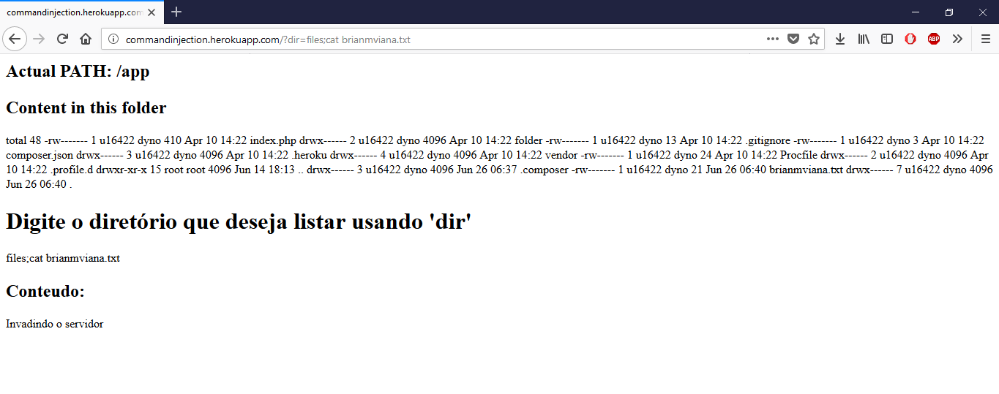

# Relatório: COMMAND INJECTION

Realizei a atividade na sala. O tutorial e bem simples e fácil de ser executado. Eu já conhecia esse tipo de ataque, porem nunca tinha realizado uma pratica do mesmo, por isso achei a proposta muito interessante. Isso poderá me ajudar a me defender de ataques desse tipo ao realizar algum projeto.

##### Passo 01

##### Passo 02

##### Passo 03

