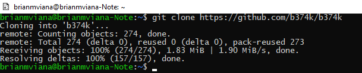

# Relatório: LOCAL FILE INCLUSION

No geral, a pratica foi fácil, minha maior dificuldade foi configurar o ambiente. Eu já conhecia esse tipo de ataque, mas nunca tinha realizado antes. Gostei muito de ter praticado e entendido o conceito.

##### Passo 01

##### Passo 02

##### Passo 03

##### Passo 04

##### Passo 05

##### Passo 06

