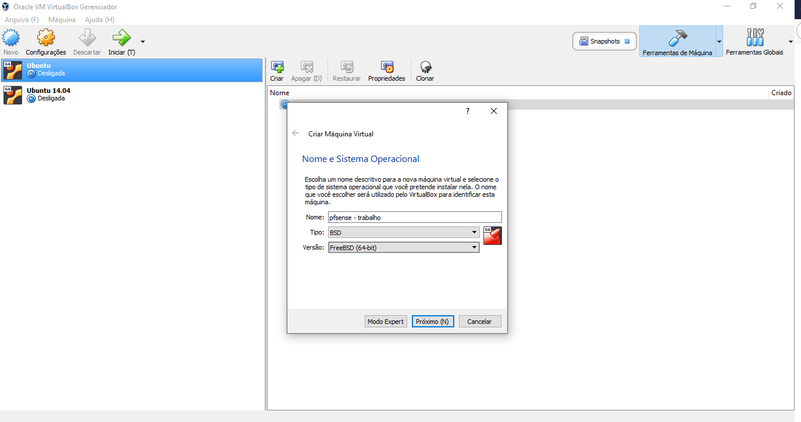
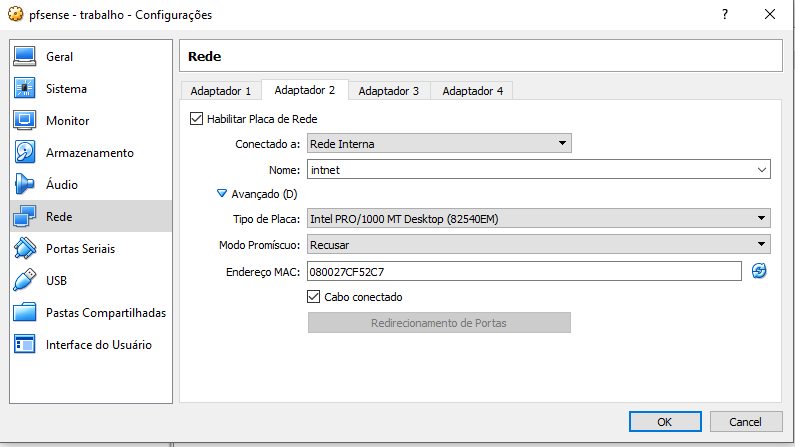
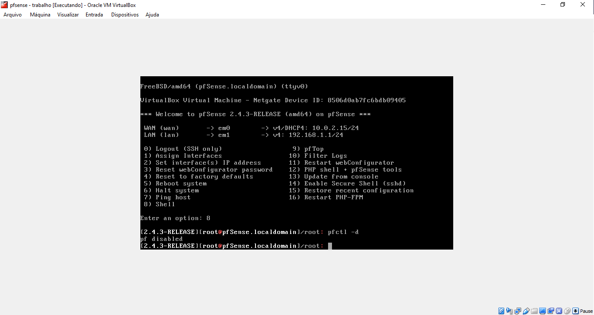
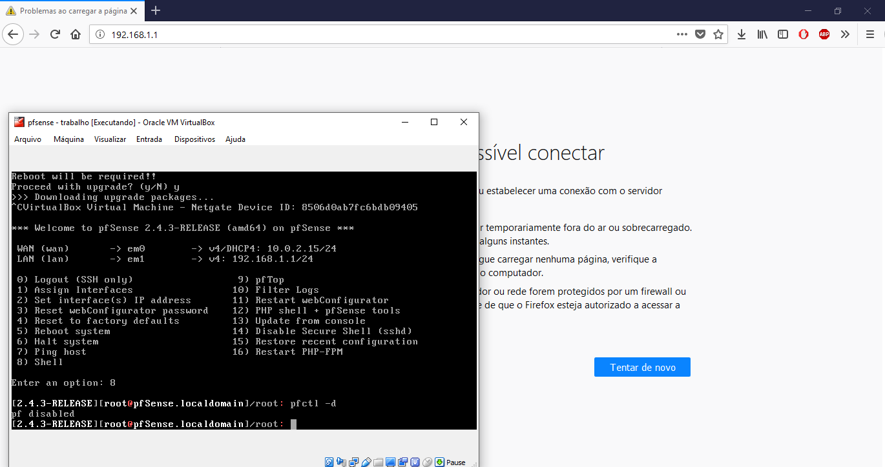
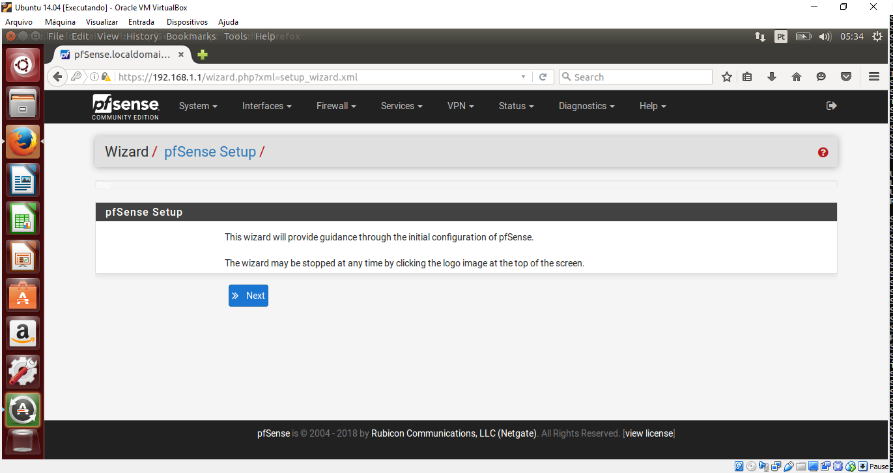
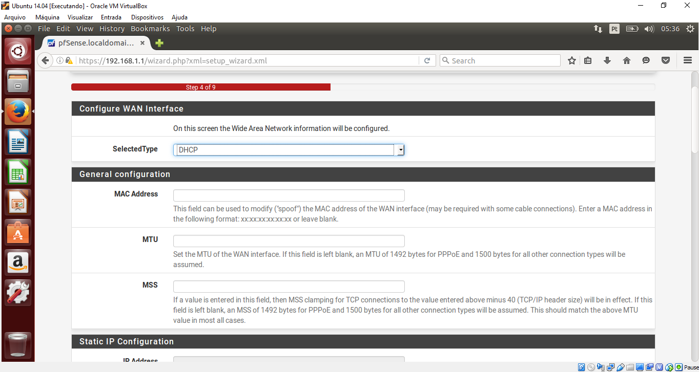
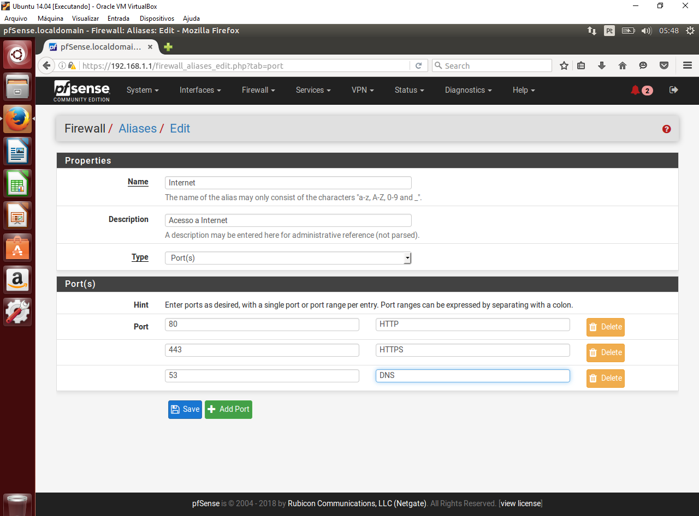
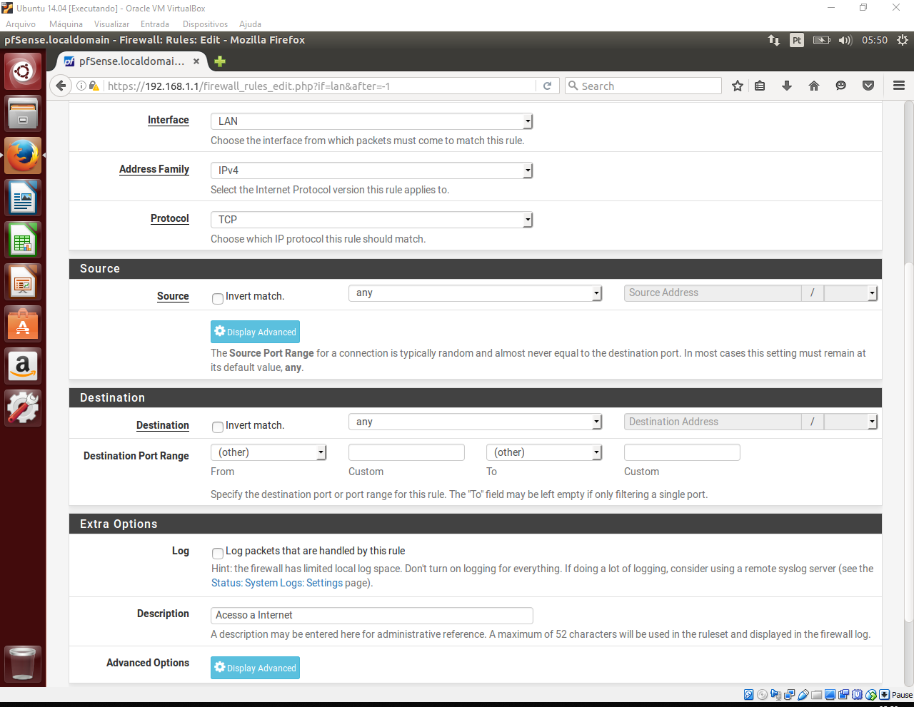
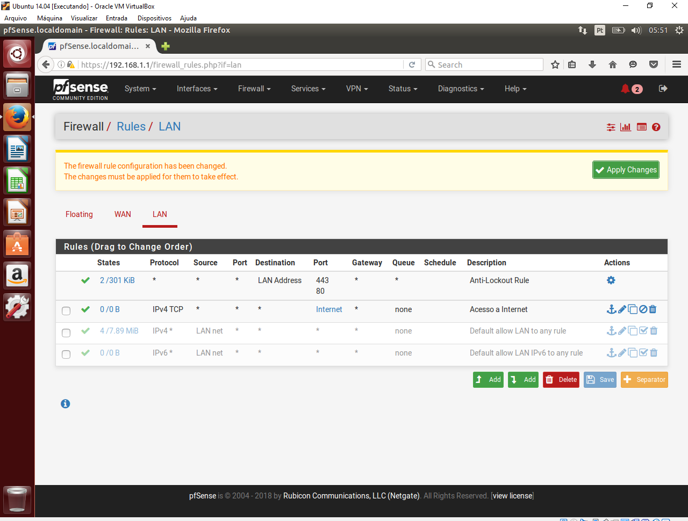

# Relatório: PFSENSE

Tentei realizar a atividade, conseguir instalar a ferramenta, porém, encontre alguns problemas na instalação, o tutorial apresentado não fala qual a versão da ferramenta deve ser instalada, então baixei uma versão diferente e realizei alguns passos diferentes do tutorial. Após realizar a instalação, mesmo com a ferramenta rodando, não consegui acessa-la. Depois de um pesquisar, entendi que o tutorial só libera o PFSENSE para rede interna. Em nenhum momento e avisado que só pode ser acessado pela rede interna. Foi então que criei um nova maquina virtual para acessa-lo, e conseguir realizar a pratica.

##### Passo 01

##### Passo 02

##### Passo 03

##### Passo 04

##### Passo 05

##### Passo 06

##### Passo 07

##### Passo 08

##### Passo 09

##### Passo 10

