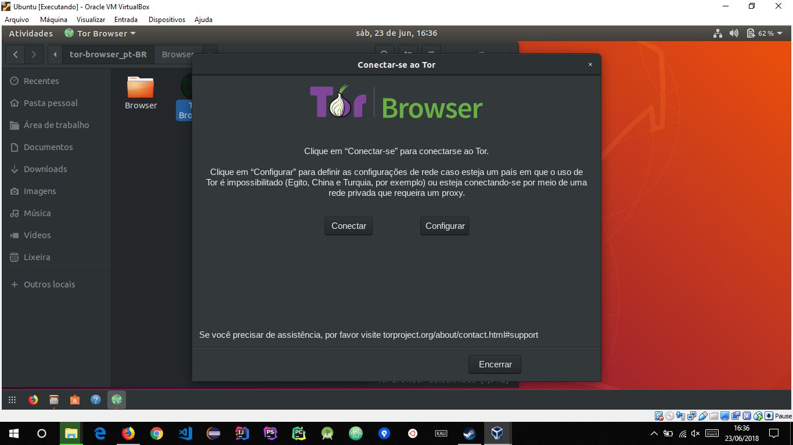
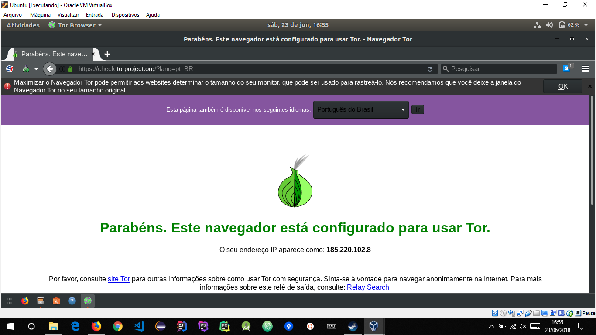
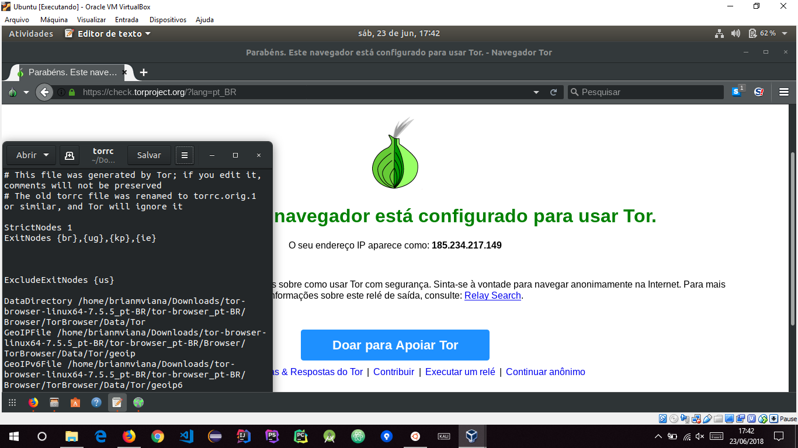

# Relatório: TOR
 A Realização do tutorial, embora fosse simples precisei pesquisar algumas coisa que não estavam bem explicadas. Achei interessante conhecer realmente o TOR, pois antes eu achava que era apenas uma versão do Firefox modificado para criptografar os dados, que fornecia um meio de acessar a DeepWeb.

 ##### Passo 01
 

 ##### Passo 02
 

 ##### Passo 03
 
